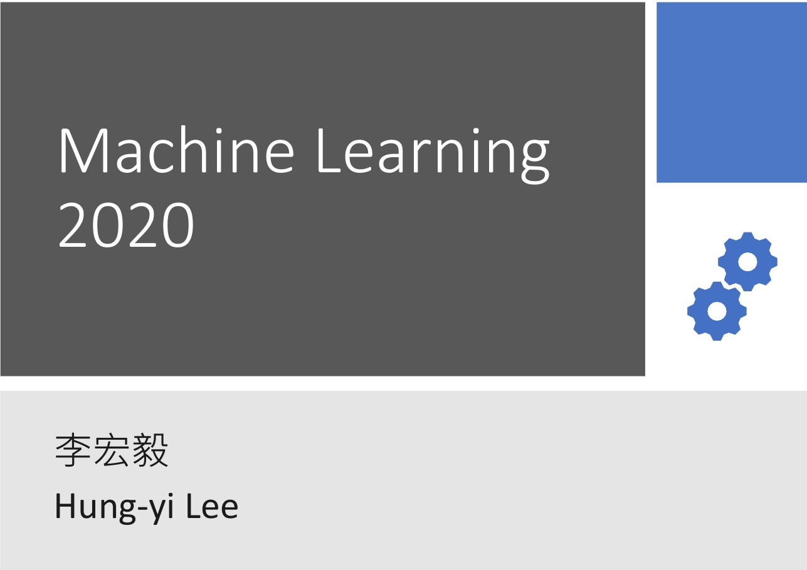

# 目标计划：

## --想要制作一份刷课计划，根据知识的前后连贯排序

### Python

- **Python 编程与实践**  By 北邮-爱可可爱生活

  :link:课程主页：​​https://github.com/fly51fly/Practical_Python_Programming

  :link:网课：https://www.bilibili.com/video/BV1b7411N7P2

  :link:教材：https://codingpy.com/books/thinkpython2/foreword.html

  

  ------

  

### 深度学习篇

- **斯坦福大学-吴恩达-机器学习 Course上的课程**

  课程视频：https://www.bilibili.com/video/BV164411b7dx

  课程笔记：电脑本地有下载  黄博的机器学习笔记

- **台湾大学-李宏毅-机器学习与深度学习**

  课程主页：http://speech.ee.ntu.edu.tw/~tlkagk/courses_ML20.html

  配套笔记：https://github.com/Sakura-gh/ML-notes/blob/master/README.md

  食用方法：依照主页课程的顺序依次完成各个章节和作业

  其他资源：在本地AI初学者文件夹下有一个**lhy_ml_hw**的文件夹，存在的是课程作业的PPT及Code；

  ​                     Github: https://github.com/Iallen520/lhy_DL_Hw

  ​                      源数据：https://pan.baidu.com/s/1xWVKnm4P6bBawASzLYskaw 提取码：akti

  

注：

- 课程主页链接的是YouTube 的视频链接，B站有搬运（已经尽量符合课程顺序）
- 此课程大部分视频都是采用的往年的，所以会存在很多不同时常的版本，不过不必过于追求完美；
- B站：https://www.bilibili.com/video/BV1JE411g7XF
- 作业说明：https://www.bilibili.com/video/av96698631/

:date:*15-05-2020*   ----------------------------------100%-------------------------------------:calendar:      

